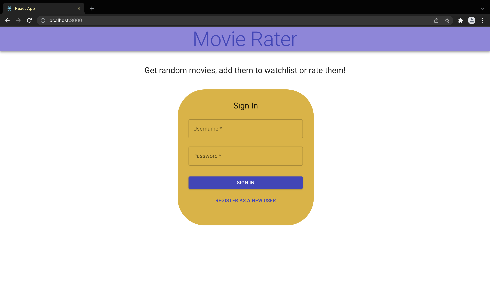
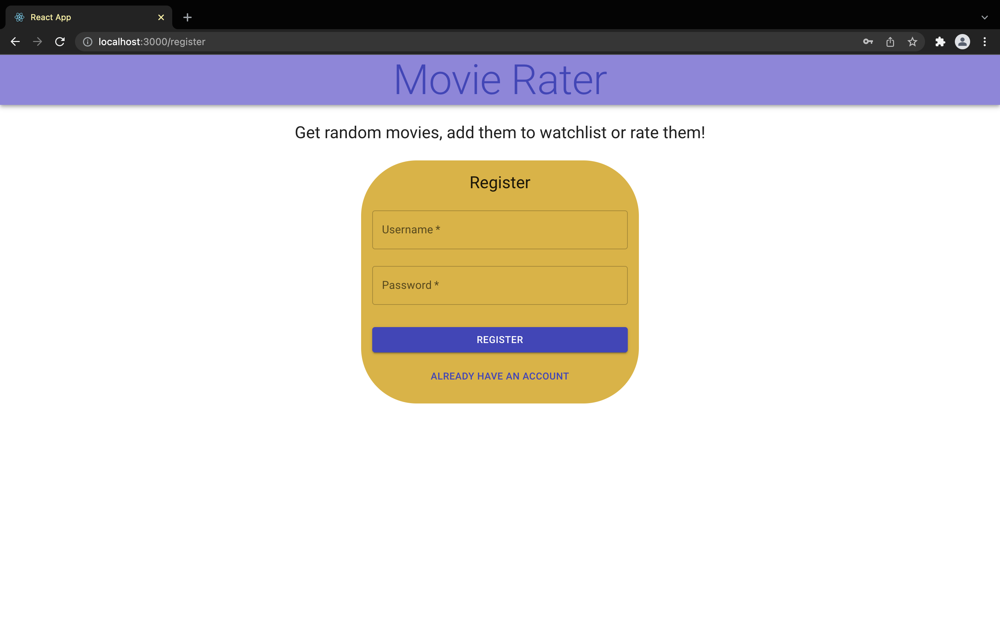
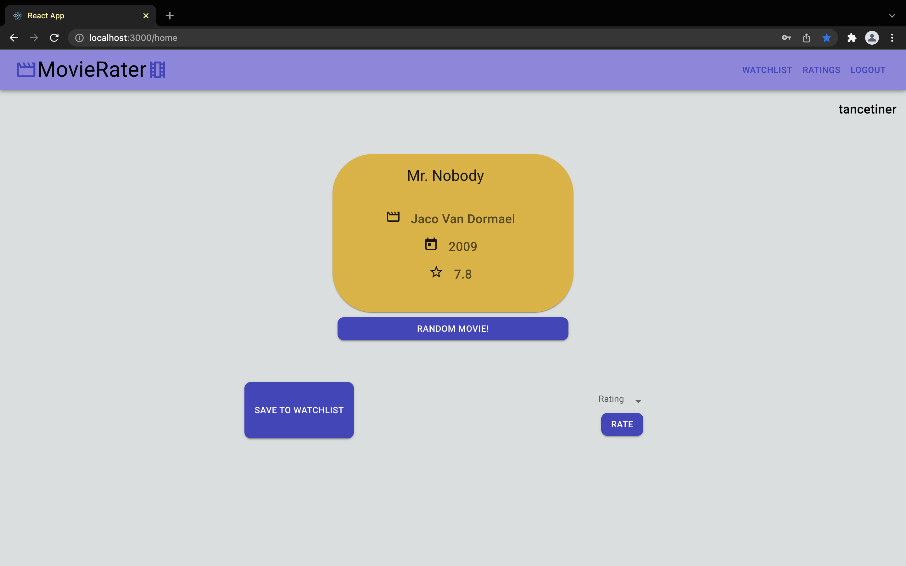
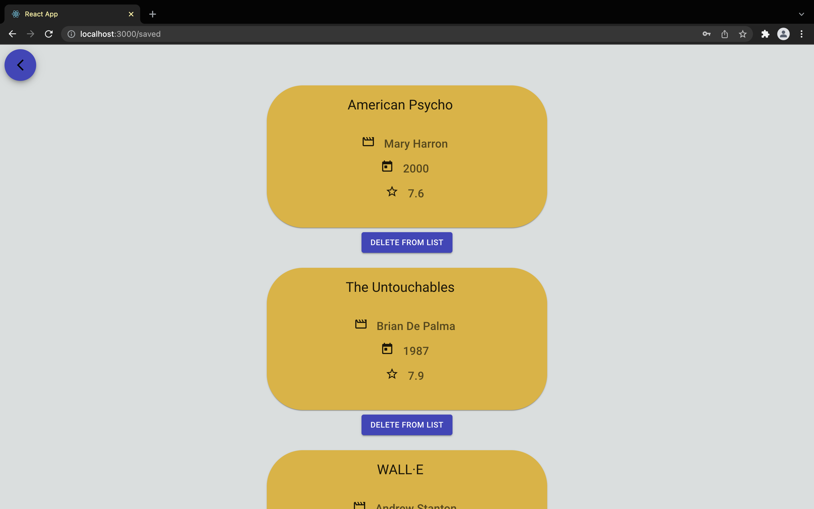
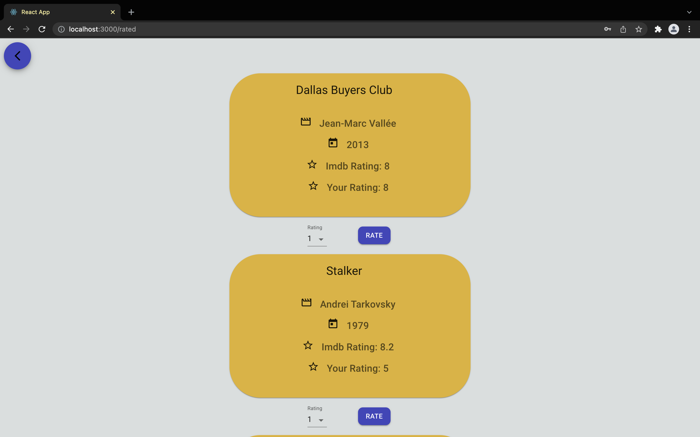

# Movie Rater
Movie Rater is a simple web application that displays random movies and lets the user to add these movies to their watchlist or rate them. User can see their watchlist and ratings afterwards.

### Table of contents

* [Motivation](#motivation)
* [Technologies](#technologies)
* [Endpoints](#endpoints) 
* [Features](#features)
* [Deployment](#deployment)
* [Screenshots](#screenshots)

### Motivation
I started to learn ReactJS for a course this semester and really enjoyed working with it. To gain more experience I started to think about a side-project idea. Internet had a lot of safe ideas such as to-do-app, note-app etc. I wanted to do something different with same technical background, then I realized I have a watchlist on my IMDB accound and sometimes I'm adding new movies there by seeing a random movie on the homepage. So, I thought it may be a good idea for some people to get random movies and have a list to watch them later!

### Technologies
I used **ReactJS** for frontend and **Django (Python)** for backend. Since it is not a complex app, I did not need a complex relational database. So I just used Django's built in **sqlite3** database for relational operations.

### Endpoints
At first, I thought about getting the movie data directly from IMDB's API, but after a quick search on web I realized a developer [(k2maan)](https://github.com/k2maan) already implemented some endpoints for getting random movie data. So, I said: 'why not use it?'. You can check his project repo from [here](https://github.com/k2maan/moviehut-random-movie-api).

### Features
It is a simple application and the features are clear, but if I need to list it:
* Sign up
* Sign in
* Get random movies
* Add the movie to your watchlist
* Rate the movie
* See your watchlist
* Delete movies from your watchlist
* See the ratings you gave to movies
* Change the ratings you had before
* Logout

### Deployment
I don't think that is the final product. I'm not sure but maybe I can add some more functionalities over time, so right now I don't deploy the app, but we'll see in the future.

### Screenshots

